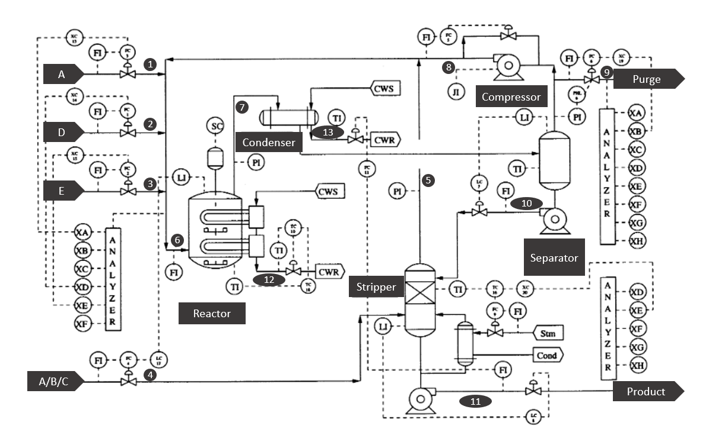

# Anomalous Process Detection using TEP Data
Process monitoring using Autoencoder Neural Network

## Tennessee Eastman process 🏭

In this project unsupervised learning technique (Auto-Encoder Neural Networks) that perform dimensionality reduction applied to the task of process monitoring. The case-study that is used is the called Tennessee Eastman process (TEP) [{cite}`downs1993plant`]. The data collected here corresponds to simulated data and it is widely used in the process monitoring community. Initially, TEP was created by the company [Eastman](https://www.eastman.com/en) to provide a realistic scenerario in which to test different process monitoring methods.

Following section provides a short explanation of the process.

The process consist of five major units:

*   Reactor
*   Condenser
*   Compressor
*   Separator
*   Stripper

and it contains eight components: the gaseous reactants $A$, $C$, $D$ and $E$ that are fed into the reactor along the inert $B$ to produce the liquids $G$ and $H$. The product $F$ is an unwanted byproduct.

$$
A(g) + C(g) + D(g) → G(liq)
$$

$$
A(g) + C(g) + E(g) → H(liq)
$$

$$
A(g) + E(g) → F(liq)
$$

$$
3D(g) → 2F(liq)
$$

The reactor product stream is then cooled using the condenser and fed to a flash separator. A recycle is implemented via the compressor with the necessary purge to prevent accumulation of $B$ and $F$. Finally, the liquid outlet of the separator is fed into a stripper for further separation. See the figure below for a schematic reresentation of the flowsheet.

  

Schematic representation of the Tennessee Eastman process flowsheet. Modified from [{cite}`russell2000data`].

The dataset contains 41 measured states and 11 manipulated variables. Some variables are sampled every 3 minutes, 6 minutes or 15 minutes. And all measurements include Gaussian noise.

The data contains 21 faults, out of which 16 are known (Faults 1-15 and 21). Some faults are caused by step changes in some process variables, while others are associated with a random variability increase. A slow drift in the reaction kinetics and sticking valves are other causes of the faults.

### **Process faults**

File | Description                                            | Type
---- | ------------------------------------------------------ | ----
00   | Normal operation                                       |
01   | A/C Feed Ratio, B Composition Constant (Stream 4)      | Step
02  | B Composition, A/C Ratio Constant (Stream 4)            | Step
03  | D Feed Temperature (Stream 2)                           | Step
04  | Reactor Cooling Water Inlet Temperature                 | Step
05  | Condenser Cooling Water Inlet Temperature               | Step
06  | A Feed Loss (Stream 1)                                  | Step
07  | C Header Pressure Loss - Reduced Availability (Stream 4)| Step
08  | A, B, C Feed Composition (Stream 4)                     | Random Variation
09  | D Feed Temperature (Stream 2)                           | Random Variation
10 | C Feed Temperature (Stream 4)                            | Random Variation
11 | Reactor Cooling Water Inlet Temperature                  | Random Variation
12 | Condenser Cooling Water Inlet Temperature                | Random Variation
13 | Reaction Kinetics                                        | Slow Drift
14 | Reactor Cooling Water Valve                              | Valve Sticking
15 | Condenser Cooling Water Valve                            |Valve Sticking
16 | Unknown
17 | Unknown
18 | Unknown
19 | Unknown
20 | Unknown
21 | Unknown

As you can suspect from the code below, the data has already being splitted into training and test.

Each dataset is reported in the form of a matrix where the 52 columns correspond to the 41 process measurements + 11 manipulated variables according to the following tables

### Process variables

**Process Measurements (3 minutes)**

Column | Description                         | Unit
------ | ----------------------------------- | ----
1      | A Feed  (stream 1)                  | kscmh
2      | D Feed  (stream 2)                  | kg/hr
3      | E Feed  (stream 3)                  | kg/hr
4      | A and C Feed  (stream 4)            | kscmh
5      | Recycle Flow  (stream 8)            | kscmh
6      | Reactor Feed Rate  (stream 6)       | kscmh
7      | Reactor Pressure                    | kPa gauge
8      | Reactor Level                       | %
9      | Reactor Temperature                 | Deg C
10     | Purge Rate (stream 9)               | kscmh
11     | Product Sep Temp                    | Deg C
12     | Product Sep Level                   | %
13     | Prod Sep Pressure                   | kPa gauge
14     | Prod Sep Underflow (stream 10)      | m3/hr
15     | Stripper Level                      | %
16     | Stripper Pressure                   | kPa gauge
17     | Stripper Underflow (stream 11)      | m3/hr
18     | Stripper Temperature                | Deg C
19     | Stripper Steam Flow                 | kg/hr
20     | Compressor Work                     | kW
21     | Reactor Cooling Water Outlet Temp   | Deg C
22     | Separator Cooling Water Outlet Temp | Deg C

**Reactor feed analysis (6 minutes)**

Column | Description | Unit
------ | ----------- | ----
23     | Component A | % mol
24     | Component B | % mol
25     | Component C | % mol
26     | Component D | % mol
27     | Component E | % mol
28     | Component F | % mol

**Purge gas analysis (6 minutes)**

Column | Description | Unit
------ | ----------- | ----
29     | Component A | % mol
30     | Component B | % mol
31     | Component C | % mol
32     | Component D | % mol
33     | Component E | % mol
34     | Component F | % mol
35     | Component G | % mol
36     | Component H | % mol

**Product analaysis (15 minutes)**

Column | Description | Unit
------ | ----------- | ----
37     | Component D | % mol
38     | Component E | % mol
39     | Component F | % mol
40     | Component G | % mol
41     | Component H | % mol

**Manipulated variables**

Column | Description 
------ | ----------- 
42     | D Feed Flow (stream 2)            
43     | E Feed Flow (stream 3)            
44     | A Feed Flow (stream 1)        
45     | A and C Feed Flow (stream 4)
46     | Compressor Recycle Valve
47     | Purge Valve (stream 9)
48     | Separator Pot Liquid Flow (stream 10)
49     | Stripper Liquid Product Flow (stream 11)
50     | Stripper Steam Valve
51     | Reactor Cooling Water Flow
52     | Condenser Cooling Water Flow
